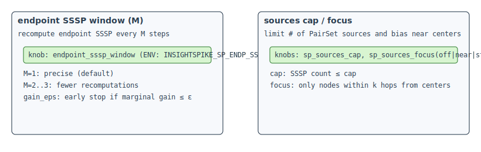

# Cached_incr Optimizations — Pruning, Window, and Sources

Status: current (2025-10-30)

## Candidate pruning (top-R)
- Keep top-R candidates by pre-score (e.g., cosine of graph.x)
- Knob: `graph.candidate_prune_topk` (ENV: `INSIGHTSPIKE_CAND_PRUNE_TOPK`)
- Effect: O(B·C) → O(B·R), R≪C; usually preserves ranking if score correlates with ΔSP

## Endpoint SSSP window (M) and epsilon early stop
- Recompute endpoint SSSP maps every M steps; default M=1 (precise)
- Early stop when marginal ΔSP gain ≤ ε
- Knobs: `graph.endpoint_sssp_window`, `graph.sp_gain_epsilon`

## PairSet sources cap and focus
- Limit number of sources from the fixed-before PairSet (`sp_sources_cap`)
- Bias sources to near centers (`sp_sources_focus: off|near|strict`)
- Reduces batched SSSP volume while emphasizing query-centric locality

## Defaults (suggested)
- `candidate_prune_topk`: 10
- `endpoint_sssp_window`: 1
- `sp_gain_epsilon`: 1e-4 … 5e-4
- `sp_pair_samples`: 80 (small graphs), 200 (mid)
- `sp_sources_cap`: 64
- `sp_sources_focus`: near

