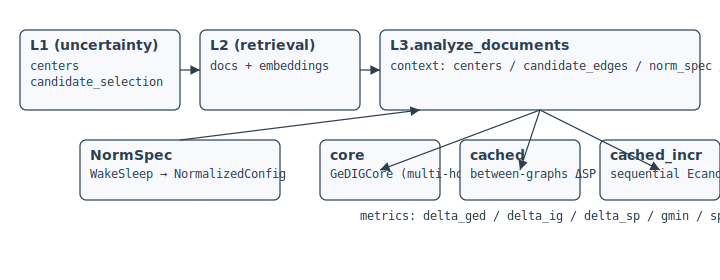

# L1/L2/L3 SP Flow — Centers, Ecand, NormSpec

Status: current (2025-10-30)

## Dataflow (text diagram)

Query → L1 (uncertainty) → L2 (retrieval)
  └─ centers (top docs indices)
  └─ candidate_selection (k★, l1_candidates, log_k★)
  └─ NormSpec (from WakeSleep SphereSearchConfig → NormalizedConfig)
    ↓
L3.analyze_documents(docs, context)
  context:
    - centers: [int,...]
    - candidate_edges: [(u,v,{'score'})...] (optional; if missing, L3 auto-proposes)
    - candidate_selection: {...}
    - norm_spec: {...}
    - previous_graph: before state
    ↓
SP engine (core | cached | cached_incr)
  - core: GeDIGCore (multi-hop; ΔSP gain per hop)
  - cached: hop0 + DistanceCache.between-graphs ΔSP
  - cached_incr: sequential adoption of Ecand with ΔSP recompute (budget)
    - fixed-before pairs (registry)
    - batched SSSP reuse for endpoints/sources
    - fallback: auto-propose Ecand from graph.x when missing
    ↓
metrics: { delta_ged, delta_ig, delta_h, delta_sp, g0, gmin, sp_engine, norm_spec, ... }

## Scope/Boundary knobs
- `graph.sp_scope_mode`: auto | union
- `graph.sp_eval_mode`: connected | fixed_before_pairs
- `graph.sp_pair_samples`: sampling size (0 = all-pairs)
- `graph.sp_use_sampling`: true/false (all-pairs vs sampling)

## NormSpec contract
- Source of truth: WakeSleep SphereSearchConfig (intuitive radii)
- NormalizedConfig builds NormSpec defaults when unspecified
- L3 echoes NormSpec in metrics for reproducibility

## Diagram

