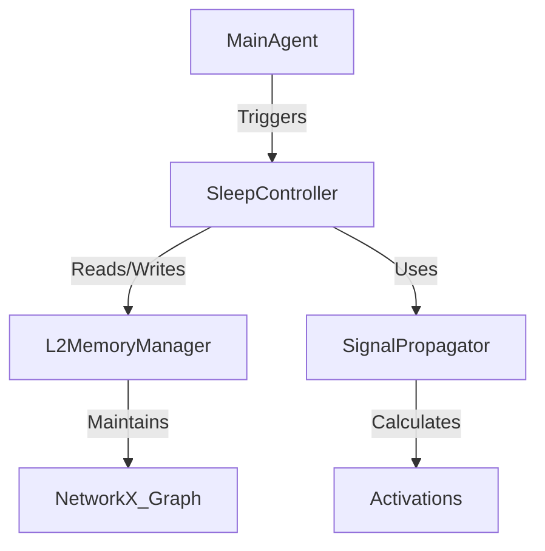

# Phase 2 Specification: Sleep & Offline Optimization

## 1. Overview
Phase 2 introduces a "Sleep" mechanism (Offline Optimization) to the InsightSpike-AI system. This mechanism mimics biological sleep cycles to consolidate memory, optimize the knowledge graph, and discover latent insights through signal propagation and Hebbian learning.

## 2. Goals
- **Memory Consolidation**: Strengthen important connections and prune weak/noisy ones.
- **Graph Optimization**: Reorganize the knowledge graph for better retrieval efficiency.
- **Insight Discovery**: Identify non-obvious connections (shortcuts) between distant nodes using simulated neural activation.
- **Energy Efficiency**: Simulate "metabolic" costs to prioritize high-value information.

## 3. Core Concepts

### 3.1 Neuromodulator Dynamics (Evolutionary Order)
We introduce neuromodulators in an order mimicking evolutionary history, starting from basic circuit control to complex stress responses.

#### 1. GABA (Inhibition & Sparsity) - *The Primitive Brake*
-   **Role**: Lateral Inhibition & Sparsity.
-   **Trigger Condition**: **"Too Many Candidates"**
    -   When the number of active nodes in a retrieval/propagation step exceeds a threshold $K_{max}$ (e.g., > 20 nodes).
    -   When the entropy of the activation distribution is too high (flat distribution).
-   **Effect**:
    -   Apply `Softmax` with low temperature (sharpening).
    -   Apply `Top-k` filtering (hard cut).
    -   Inhibit (reduce activation of) neighbors of the "Winner" node.

#### 2. Dopamine (Reward & Reinforcement) - *The Seeker*
-   **Role**: Global Reinforcement Signal.
-   **Trigger Condition**: **"Insight Discovery" (DG Closure)**
    -   **Positive**: $\Delta \text{geDIG} > \theta_{insight}$ (Significant gain in structure/information).
    -   **Negative**: Contradiction detected (e.g., logical negation found in path).
-   **Effect**: Modulates plasticity (STDP). "Stamps in" the active path that led to the reward.

#### 3. Acetylcholine (Attention & State Switching) - *The Modulator*
-   **Role**: Encoding (Wake) vs. Consolidation (Sleep) switch.
-   **Trigger Condition**: **"Novelty vs. Familiarity"**
    -   **High (Wake)**: High prediction error (AG Open) on *new* input. System needs to encode external data.
    -   **Low (Sleep)**: Low external input, or "Sleep Pressure" (time since last sleep) exceeds threshold.
-   **Effect**:
    -   **High**: Boosts sensory input weights, suppresses internal recurrent weights.
    -   **Low**: Boosts internal recurrent weights (Replay), suppresses sensory input.

#### 4. Cortisol (Stress & Adaptation) - *The Regulator*
-   **Role**: Resource Management & "Giving Up".
-   **Trigger Condition**: **"Frustration" (Chronic Error)**
    -   **Acute**: AG remains open for $T_{acute}$ cycles (e.g., 3 steps).
    -   **Chronic**: AG remains open for $T_{chronic}$ cycles (e.g., 10 steps) OR total path cost exceeds budget.
-   **Effect**:
    -   **Acute**: Increase "Temperature" (randomness/exploration) and Gain (attention).
    -   **Chronic**: Prune the current search branch (give up), lower global learning rate (depression/protection).


### 3.2 Signal Propagation
Simulates neural activation spreading through the graph.
- **Seed Nodes**: Activation starts from "seed" nodes (e.g., recently accessed, high importance, or random for exploration).
- **Decay**: Signal strength decays by a factor $\gamma$ (e.g., 0.8) at each hop.
- **Threshold**: Propagation stops when signal strength drops below a threshold $\theta$ (e.g., 0.1).

### 3.3 Hebbian Learning
"Cells that fire together, wire together."
- **Update Rule**: $\Delta w_{ij} = \eta \cdot (s_i \cdot s_j)$
  - $w_{ij}$: Weight of edge between node $i$ and $j$.
  - $\eta$: Learning rate.
  - $s_i, s_j$: Activation signals of nodes $i$ and $j$.
- **Normalization**: Weights are clamped between 0.0 and 1.0.

### 3.4 Sleep Cycle
The sleep process consists of multiple stages:
1.  **NREM (Non-Rapid Eye Movement)**:
    -   Focus: Local consolidation and pruning.
    -   Action: Strengthen existing strong connections, remove weak/old edges.
2.  **REM (Rapid Eye Movement)**:
    -   Focus: Global exploration and insight generation.
    -   Action: Propagate signals further (lower decay), create new edges between highly co-activated distant nodes (shortcuts).

## 4. Architecture

### 4.1 Component Interaction


### 4.2 Class Design

#### `EdgeAttributes` (Data Structure)
```python
@dataclass
class EdgeAttributes:
    strength: float = 1.0
    last_activated: float = 0.0
    usage_count: int = 0
    gedig_contribution: float = 0.0
```

#### `SleepController` (Logic)
- **`enter_sleep(duration)`**: Starts the sleep cycle.
- **`_propagate_signal(seeds)`**: Spreads activation from seeds.
- **`_apply_hebbian_update(activations)`**: Updates edge weights based on co-activation.
- **`_prune_graph()`**: Removes edges below threshold.
- **`_rewire_graph(activations)`**: Creates new edges (insights).

#### `L2MemoryManager` (Storage)
- **`graph`**: A `networkx.Graph` instance storing the persistent knowledge structure.
- **`_sync_networkx_graph(pyg_graph)`**: Syncs transient PyG graphs (from `ScalableGraphBuilder`) to the persistent NetworkX graph.

## 5. Process Flow

1.  **Wake Phase (Online)**:
    -   Agent processes queries and documents.
    -   `L2MemoryManager` updates `usage_count` and `last_activated` for accessed nodes/edges.
    -   New edges are added with default strength.

2.  **Sleep Phase (Offline)**:
    -   **Trigger**: Called manually (`agent.sleep()`) or automatically (e.g., after N episodes).
    -   **Step 1: Seed Selection**: Pick top-k nodes by importance or recency.
    -   **Step 2: Propagation**: Run BFS/DFS to calculate node activations.
    -   **Step 3: Hebbian Update**: Adjust weights $w_{ij}$.
    -   **Step 4: Rewiring (REM)**: If nodes $u$ and $v$ are not connected but have high $s_u \cdot s_v$, create edge $(u, v)$.
    -   **Step 5: Pruning (NREM)**: Remove edges where $w < \theta_{prune}$ and age > limit.

## 6. Configuration
New configuration parameters in `config.yaml`:
```yaml
sleep:
  enable_auto_sleep: true
  interval_episodes: 100
  learning_rate: 0.1
  decay_factor: 0.8
  prune_threshold: 0.2
  rem_probability: 0.3
```

## 7. Future Extensions
- **Dreaming**: Generative replay of episodes using the consolidated graph.
- **Forgetting**: Active forgetting of interfering memories.
- **Multi-Agent Sleep**: Synchronized sleep cycles for swarm intelligence.
