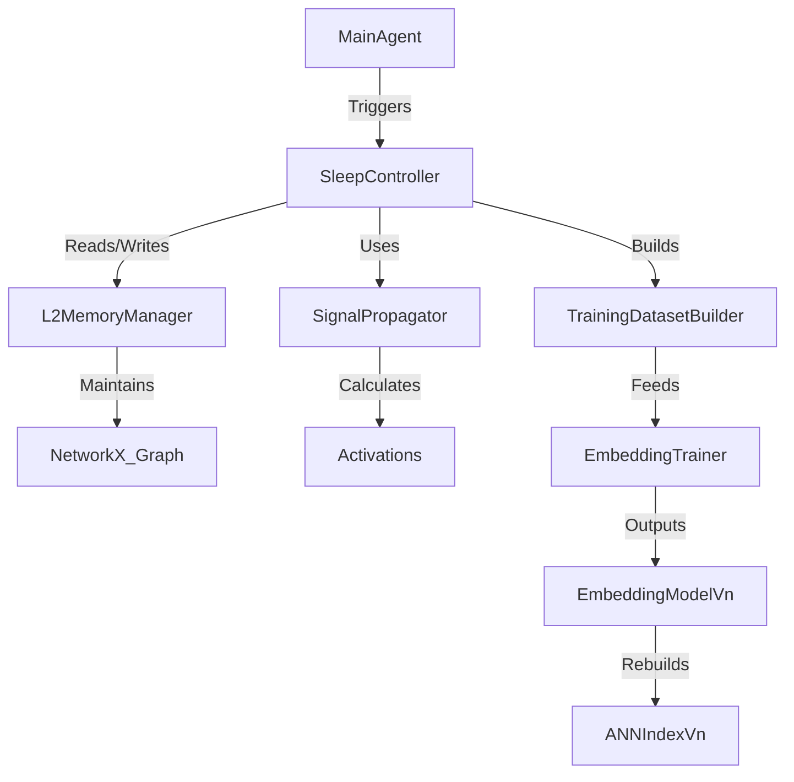

# Phase 2 Specification: Sleep & Offline Optimization

## 1. Overview
Phase 2 introduces a "Sleep" mechanism (Offline Optimization) to the InsightSpike-AI system. This mechanism mimics biological sleep cycles to consolidate memory, optimize the knowledge graph, and discover latent insights through signal propagation and Hebbian learning.

## 2. Goals
- **Memory Consolidation**: Strengthen important connections and prune weak/noisy ones.
- **Graph Optimization**: Reorganize the knowledge graph for better retrieval efficiency.
- **Insight Discovery**: Identify non-obvious connections (shortcuts) between distant nodes using simulated neural activation.
- **Energy Efficiency**: Simulate "metabolic" costs to prioritize high-value information.
- **Representation Improvement (Embeddings)**: Convert Phase 1 decisions into contrastive training data to update the embedding model and rebuild the ANN index, while keeping Phase 1 runtime logic reusable.

## 3. Core Concepts

### 3.1 Neuromodulator Dynamics (Evolutionary Order)
We introduce neuromodulators in an order mimicking evolutionary history, starting from basic circuit control to complex stress responses.

#### 1. GABA (Inhibition & Sparsity) - *The Primitive Brake*
-   **Role**: Lateral Inhibition & Sparsity.
-   **Trigger Condition**: **"Too Many Candidates"**
    -   When the number of active nodes in a retrieval/propagation step exceeds a threshold $K_{max}$ (e.g., > 20 nodes).
    -   When the entropy of the activation distribution is too high (flat distribution).
-   **Effect**:
    -   Apply `Softmax` with low temperature (sharpening).
    -   Apply `Top-k` filtering (hard cut).
    -   Inhibit (reduce activation of) neighbors of the "Winner" node.

#### 2. Dopamine (Reward & Reinforcement) - *The Seeker*
-   **Role**: Global Reinforcement Signal.
-   **Trigger Condition**: **"Insight Discovery" (DG Closure)**
    -   **Positive**: $\Delta \text{geDIG} > \theta_{insight}$ (Significant gain in structure/information).
    -   **Negative**: Contradiction detected (e.g., logical negation found in path).
-   **Effect**: Modulates plasticity (STDP). "Stamps in" the active path that led to the reward.

#### 3. Acetylcholine (Attention & State Switching) - *The Modulator*
-   **Role**: Encoding (Wake) vs. Consolidation (Sleep) switch.
-   **Trigger Condition**: **"Novelty vs. Familiarity"**
    -   **High (Wake)**: High prediction error (AG Open) on *new* input. System needs to encode external data.
    -   **Low (Sleep)**: Low external input, or "Sleep Pressure" (time since last sleep) exceeds threshold.
-   **Effect**:
    -   **High**: Boosts sensory input weights, suppresses internal recurrent weights.
    -   **Low**: Boosts internal recurrent weights (Replay), suppresses sensory input.

#### 4. Cortisol (Stress & Adaptation) - *The Regulator*
-   **Role**: Resource Management & "Giving Up".
-   **Trigger Condition**: **"Frustration" (Chronic Error)**
    -   **Acute**: AG remains open for $T_{acute}$ cycles (e.g., 3 steps).
    -   **Chronic**: AG remains open for $T_{chronic}$ cycles (e.g., 10 steps) OR total path cost exceeds budget.
-   **Effect**:
    -   **Acute**: Increase "Temperature" (randomness/exploration) and Gain (attention).
    -   **Chronic**: Prune the current search branch (give up), lower global learning rate (depression/protection).


### 3.2 Signal Propagation
Simulates neural activation spreading through the graph.
- **Seed Nodes**: Activation starts from "seed" nodes (e.g., recently accessed, high importance, or random for exploration).
- **Decay**: Signal strength decays by a factor $\gamma$ (e.g., 0.8) at each hop.
- **Threshold**: Propagation stops when signal strength drops below a threshold $\theta$ (e.g., 0.1).

### 3.3 Hebbian Learning
"Cells that fire together, wire together."
- **Update Rule**: $\Delta w_{ij} = \eta \cdot (s_i \cdot s_j)$
  - $w_{ij}$: Weight of edge between node $i$ and $j$.
  - $\eta$: Learning rate.
  - $s_i, s_j$: Activation signals of nodes $i$ and $j$.
- **Normalization**: Weights are clamped between 0.0 and 1.0.

### 3.4 Sleep Cycle
The sleep process consists of multiple stages:
1.  **NREM (Non-Rapid Eye Movement)**:
    -   Focus: Local consolidation and pruning.
    -   Action: Strengthen existing strong connections, remove weak/old edges.
2.  **REM (Rapid Eye Movement)**:
    -   Focus: Global exploration and insight generation.
    -   Action: Propagate signals further (lower decay), create new edges between highly co-activated distant nodes (shortcuts).

### 3.5 Learning-Dataization (Edge Event Log → Contrastive Samples)
If Phase 2 starts with embedding updates (contrastive learning + index rebuild), the key prerequisite is not “storing high-dimensional features on every graph edge”, but **emitting a reliable training dataset from Phase 1 logs**.

- **Principle**: Phase 1 emits *event logs*; Phase 2 converts them into `(anchor, positive, negative, weight)` samples.
- **Why**: Keeps Phase 1 light and reusable; avoids overloading the graph store with training-only fields; enables versioned reproducibility.
- **Minimal sample schema (example)**:
  - `anchor_id` (query / episode id)
  - `pos_id` (DG-confirmed target / supporting episode)
  - `neg_id` (rolled-back / rejected / hard negative episode)
  - `weight` (e.g., improvement magnitude like `g0 - gmin`, or `-Fmin`, or reward proxy)
  - `label` / `outcome` (`confirmed` / `pending` / `rollback`)
  - `embedding_version`, `index_version`, `graph_version`
  - optional diagnostics: `g0`, `gmin`, `delta_h_norm`, `delta_sp_rel`, `fmr_flag`, timestamps

## 4. Architecture

### 4.1 Component Interaction


### 4.2 Class Design

#### `EdgeAttributes` (Data Structure)
```python
@dataclass
class EdgeAttributes:
    strength: float = 1.0
    last_activated: float = 0.0
    usage_count: int = 0
    gedig_contribution: float = 0.0
```

#### `SleepController` (Logic)
- **`enter_sleep(duration)`**: Starts the sleep cycle.
- **`_propagate_signal(seeds)`**: Spreads activation from seeds.
- **`_apply_hebbian_update(activations)`**: Updates edge weights based on co-activation.
- **`_prune_graph()`**: Removes edges below threshold.
- **`_rewire_graph(activations)`**: Creates new edges (insights).
- **`_build_training_dataset(events)`**: Builds contrastive samples from Phase 1 event logs.
- **`_train_embedding(dataset)`**: Fine-tunes the embedder.
- **`_rebuild_index()`**: Rebuilds the ANN index and bumps `embedding_version/index_version`.

#### `L2MemoryManager` (Storage)
- **`graph`**: A `networkx.Graph` instance storing the persistent knowledge structure.
- **`_sync_networkx_graph(pyg_graph)`**: Syncs transient PyG graphs (from `ScalableGraphBuilder`) to the persistent NetworkX graph.

## 5. Process Flow

1.  **Wake Phase (Online)**:
    -   Agent processes queries and documents.
    -   `L2MemoryManager` updates `usage_count` and `last_activated` for accessed nodes/edges.
    -   New edges are added with default strength.
    -   **Emit event logs** for Phase 2 training (confirmed/pending/rollback, g0/gmin, etc.).

2.  **Sleep Phase (Offline)**:
    -   **Trigger**: Called manually (`agent.sleep()`) or automatically (e.g., after N episodes).
    -   **Step 1: Seed Selection**: Pick top-k nodes by importance or recency.
    -   **Step 2: Propagation**: Run BFS/DFS to calculate node activations.
    -   **Step 3: Hebbian Update**: Adjust weights $w_{ij}$.
    -   **Step 4: Rewiring (REM)**: If nodes $u$ and $v$ are not connected but have high $s_u \cdot s_v$, create edge $(u, v)$.
    -   **Step 5: Pruning (NREM)**: Remove edges where $w < \theta_{prune}$ and age > limit.
    -   **Step 6: Contrastive Training**: Build dataset from event logs and fine-tune embeddings.
    -   **Step 7: Index Rebuild**: Rebuild ANN index for the updated embeddings.
    -   **Step 8: Recalibration (optional)**: Recompute burn-in quantiles / thresholds for AG/DG under the new embedding distribution.

## 6. Configuration
New configuration parameters in `config.yaml`:
```yaml
sleep:
  enable_auto_sleep: true
  interval_episodes: 100
  learning_rate: 0.1
  decay_factor: 0.8
  prune_threshold: 0.2
  rem_probability: 0.3
```

## 7. Future Extensions
- **Dreaming**: Generative replay of episodes using the consolidated graph.
- **Forgetting**: Active forgetting of interfering memories.
- **Multi-Agent Sleep**: Synchronized sleep cycles for swarm intelligence.

## 8. Backward Impact & Reuse (Phase 1 Compatibility)
- **ΔSP logic can remain unchanged**: embedding updates change *which edges are proposed/accepted*, but shortest-path measurement over the (unweighted) graph can be reused as-is. Treat any weighted-shortest-path variant as an optional later mode.
- **Expect distribution shifts**: `ΔH_norm`, `g0`, and gate firing rates will shift when embeddings change. Plan to recalibrate AG/DG thresholds after each `embedding_version` bump.
- **Version everything**: Always log `embedding_version/index_version/graph_version` so Phase 1 runs are reproducible and comparable across deployments.
- **Stable contracts**: Keep embedding dimensionality and similarity scoring consistent across versions to avoid breaking Phase 1 components.

## 9. Maze Application: Goal-Discovered Value Propagation (Strict No-Peeking)
For the maze PoC, we can apply Phase 2 as **goal-value propagation over *experienced transitions*** and then use the propagated signal as a bias term in Phase 1 action selection.

See also: `docs/research/phase2/entropy_temperature_spec.md` (Softmax Shannon entropy / temperature definition shared by Phase 1 metrics and Phase 2 action bias).

### 9.1 No-Peeking Contract
- Before reaching the goal in an episode, Phase 1 must not use goal coordinates or “is_goal” labels as features.
- Goal supervision enters Phase 2 only **after** a successful episode ends (goal discovered).
- Propagation is performed only on *experienced* transition edges (e.g., timeline edges), not on unvisited states/actions.

### 9.2 Phase 1 Logging Prerequisites (per episode)
Emit a minimal event log sufficient to reconstruct a directed transition graph:
- `Q_t` (query node / state id; e.g., position)
- executed action `a_t` (direction)
- `Q_{t+1}` (next query node)
- `done` and `is_goal_reached` at episode end

This can be stored as a compact “timeline edge log” (Q→dir→Q) or as direct `(Q_t, a_t, Q_{t+1})` tuples.

### 9.3 Phase 2 (Sleep): Value Propagation on Experienced Transitions
Given a discovered goal state `Q_goal`, define a potential/value on states:
- Compute reverse BFS distances `d(Q)` to `Q_goal` over the experienced transition graph.
- Define `V(Q) := γ^{d(Q)}` with `V(Q_goal)=1` and `V(Q)=0` if unreachable in the experienced graph.

Define an edge/action feature (goal potential) for action selection:
- For each state-action `(Q, a)` that leads to `Q'`, define `φ_goal(Q,a) := V(Q')`.
- Optionally use an advantage-style normalization: `A(Q,a) := V(Q') - mean_{a'} V(Q_{a'})` to avoid uniform bias.

Persist the resulting scalar feature as an edge attribute or as a `(state,action)->value` table with `maze_layout_id` and `episode_id`/`embedding_version`.

### 9.4 Phase 1 Reuse: Softmax Action Bias
Phase 1 action selection can remain a softmax over base scores, with an additive bias:
- `logit(a) := base_score(a) + β·φ_goal(Q,a)` (or `β·A(Q,a)`)
- `p(a|Q) ∝ exp(logit(a)/τ)`

This design keeps the geDIG evaluation (AG/DG, ΔH, ΔSP) unchanged, and uses Phase 2 only to bias the *behavior policy*.

### 9.5 Weight / Distance Definition (compatibility rule)
To keep Phase 1/Phase 2 consistent (and backward compatible), define candidate weights as **Boltzmann weights**.

- **Distance-first (recommended in maze)**:
  - Define a non-negative mismatch distance: `d_i := ||W·(q - x_i)||` (weighted L2 norm), or `d_i := 1 - cos(q, x_i)`.
  - Define the (pre-temperature) weight: `w_i := exp(-d_i / T0)` where `T0` is the scale used to map distance → similarity.
  - Sample actions/candidates with: `p_i(τ) = softmax(-d_i / (T0·τ))`.

- **Weight-first (backward compatible with current Linkset Shannon)**:
  - If Phase 1 already produces a positive `similarity` that is effectively a weight `w_i>0`, then **do not** apply `exp(w_i/τ)` (double exponential risk).
  - Instead, use the power-normalized form: `p_i(τ) ∝ w_i^(1/τ)` which is equivalent to `softmax(log w_i / τ)`.
  - **Compatibility guarantee**: `τ=1` recovers the current normalization `p_i = w_i / sum(w)`.

This rule also standardizes the entropy term: `H = -∑ p_i log p_i`, and keeps the “additive bias then softmax” pattern (`base_logit + β·φ_goal`) consistent across Phase 1 and Phase 2.

### 9.6 Contrastive Learning Hook (Optional)
The propagated potentials can be directly “dataized” into contrastive samples:
- `anchor = embedding(Q)`
- `positive = embedding(dir_best)` or `embedding(Q_next_best)`
- `negative = embedding(dir_other)` / hard negatives from dead-ends
- `weight ∝ A(Q,a)` or `φ_goal(Q,a)`

This closes the loop: goal-discovered supervision → Phase2 propagation → behavior bias + embedding updates → improved Phase1.

## 10. 温度パラメータ（ΔH / 行動 softmax）の確認メモ
- **後方互換**: `τ=1` は現行の線形正規化と同一挙動（Linkset Shannon）、Phase 1 の評価を壊さない。
- **実装ノブ**: `INSIGHTSPIKE_ENTROPY_TAU` または `MAZE_GEDIG_ENTROPY_TAU` で上書き。Linkset IG で `p∝w^{1/τ}` を採用済み。
- **簡易スキャン（maze, linkset IG, base=pool, norm=cand, θ_cand=θ_link=10, radius=100, steps=10）**  
  - `k*≈20.8` 平均。  
  - `τ=0.5/1.0/2.0` で `avg ΔH_norm ≈ 0.2505 / 0.2504 / 0.2408`、`H_after ≈ 0.6931 / 0.6932 / 0.7249`。  
  - `g0_mean ≈ 0.5316 / 0.5316 / 0.5413`、`gmin_mean ≈ 0.4624 / 0.4624 / 0.4720`。  
  - 傾向: τ↑で分布がフラット化し IG が弱まる → g がやや上振れ（構造コスト優勢）。後方互換は維持。
