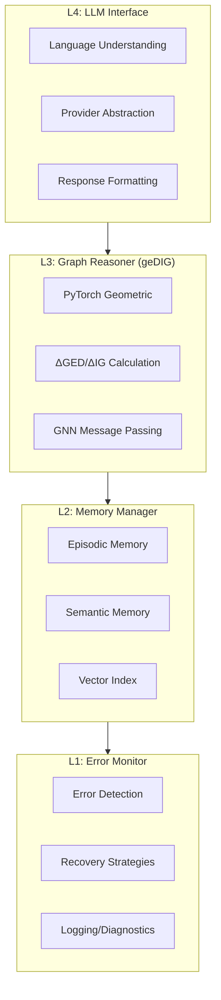
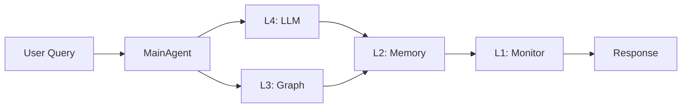
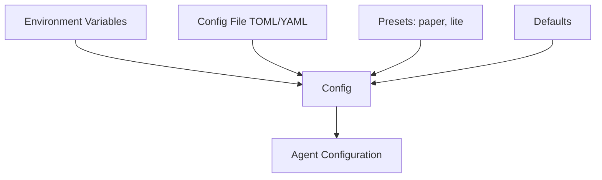

# Architecture

Comprehensive summary of InsightSpike-AI system architecture.

## 4-Layer Brain-Inspired Design



---

## Data Flow



---

## Key Components

### Core Classes

| Class | Layer | Purpose | Location |
|-------|-------|---------|----------|
| `MainAgent` | All | Orchestrates all layers | `implementations/agents/main_agent.py` |
| `L3GraphReasoner` | L3 | Graph reasoning | `implementations/layers/layer3_graph_reasoner.py` |
| `L2MemoryManager` | L2 | Memory operations | `implementations/layers/layer2_memory_manager.py` |
| `ErrorMonitor` | L1 | Error handling | `implementations/layers/layer1_error_monitor.py` |
| `OpenAIProvider` | L4 | Handles OpenAI & **Ollama** | `providers/openai_provider.py` |
| `get_llm_provider` | L4 | Legacy LLM abstraction | `implementations/layers/layer4_llm_interface.py` |

### Agent Types

| Agent | Description | Use Case |
|-------|-------------|----------|
| `MainAgent` | Full 4-layer architecture | Production |
| `GenericInsightSpikeAgent` | Configurable generic agent | Custom pipelines |
| `DataStoreMainAgent` | With SQLite persistence | Data-intensive apps |
| `StandaloneL3GraphReasoner` | Independent reasoning | Research/testing |

---

## L3 Graph Reasoner Architecture


### Key Components

| Component | Class | Purpose |
|-----------|-------|---------|
| Graph Builder | `ScalableGraphBuilder` | Construct similarity graphs |
| Message Passing | `MessagePassing` | GNN propagation |
| Edge Reevaluator | `EdgeReevaluator` | Dynamic edge weights |
| Conflict Scorer | `ConflictScore` | Reasoning conflicts |
| Graph Analyzer | `GraphAnalyzer` | Metric computation |
| Reward Calculator | `RewardCalculator` | Memory update signals |

---

## Configuration Hierarchy



### Presets

| Preset | Description | Activation |
|--------|-------------|------------|
| `paper` | Paper-aligned parameters | `INSIGHTSPIKE_PRESET=paper` |
| `lite` | Minimal imports | `INSIGHTSPIKE_LITE_MODE=1` |

---

## Directory Structure

```mermaid
graph TB
    src[src/insightspike/] --> algorithms
    src --> config
    src --> core
    src --> detection
    src --> graph
    src --> implementations
    src --> metrics
    src --> providers
    src --> tools
    
    implementations --> agents
    implementations --> layers
    implementations --> memory
    
    layers --> layer3[layer3/]
```

---

## Test Coverage

Verified by `docxology/tests/test_smoke.py`:

| Test Class | Tests | Status |
|------------|-------|--------|
| `TestImports` | 6 | ✅ Real imports verified |
| `TestConfig` | 2 | ✅ Config loading verified |
| `TestDiscovery` | 4 | ✅ Discovery system verified |
| `TestRunners` | 3 | ✅ Runners verified |
| `TestOrchestrator` | 2 | ✅ Pipeline verified |
| `TestAnalysis` | 2 | ✅ Analysis verified |
| `TestVisualization` | 2 | ✅ Visualization verified |
| `TestOllamaIntegration` | 4 | ✅ Ollama/Ministral verification |
| `TestLLMProviders` | 17 | ✅ Real provider initialization |
| **Total** | **42** | **All tests passed** |

---

## Source Documents

| Document | Path |
|----------|------|
| Architecture Overview | [architecture/README.md](../../docs/architecture/README.md) |
| Layer Architecture | [architecture/layer_architecture.md](../../docs/architecture/layer_architecture.md) |
| Agent Types | [architecture/agent_types.md](../../docs/architecture/agent_types.md) |
| Configuration | [architecture/configuration.md](../../docs/architecture/configuration.md) |
| Directory Structure | [architecture/directory_structure.md](../../docs/architecture/directory_structure.md) |
| MainAgent Behavior | [architecture/mainagent_behavior.md](../../docs/architecture/mainagent_behavior.md) |
| Data Management | [architecture/data_management_strategy.md](../../docs/architecture/data_management_strategy.md) |

### Implementation Files

| Component | Source File |
|-----------|-------------|
| Main Agent | [main_agent.py](../../src/insightspike/implementations/agents/main_agent.py) |
| L4 LLM Interface | [layer4_llm_interface.py](../../src/insightspike/implementations/layers/layer4_llm_interface.py) |
| L3 Graph Reasoner | [layer3_graph_reasoner.py](../../src/insightspike/implementations/layers/layer3_graph_reasoner.py) |
| L2 Memory Manager | [layer2_memory_manager.py](../../src/insightspike/implementations/layers/layer2_memory_manager.py) |
| L1 Error Monitor | [layer1_error_monitor.py](../../src/insightspike/implementations/layers/layer1_error_monitor.py) |
| Provider Factory | [provider_factory.py](../../src/insightspike/providers/provider_factory.py) |
