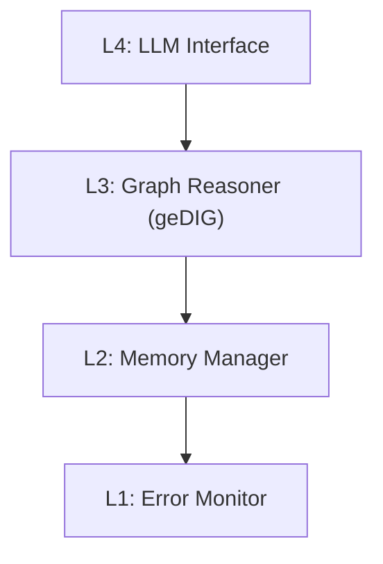
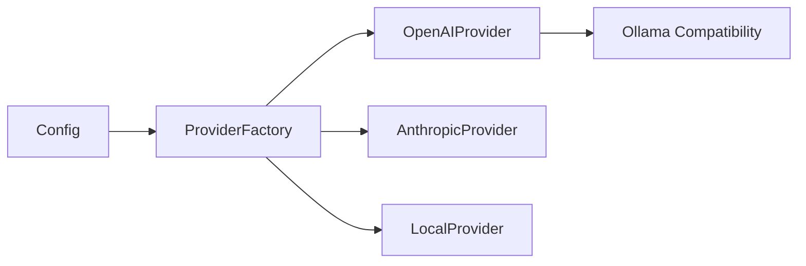

# InsightSpike-AI System Overview

Comprehensive summary of the entire InsightSpike-AI platform with complete signposting to source files.

---

## What is InsightSpike-AI?

InsightSpike-AI is a **brain-inspired multi-agent research platform** implementing Active Inference and the **geDIG (Graph Edit Distance as Insight Gauge)** framework. It detects "eureka moments" — structural transformations in knowledge that signify genuine insight.

### Core Innovation

The system operationalizes the hypothesis that **insight = minimal graph transformation achieving structural isomorphism**:

```
T* = argmin_T GED(T(G₁), G₂)
```

> *Find the transformation T that minimizes graph edit distance between knowledge structures. That transformation IS the insight.*

---

## System Architecture

### 4-Layer Brain-Inspired Design



| Layer | Purpose | Key File |
|-------|---------|----------|
| **L4** | Language understanding & generation | [layer4_llm_interface.py](../../src/insightspike/implementations/layers/layer4_llm_interface.py) |
| **L3** | Graph reasoning & geDIG metrics | [layer3_graph_reasoner.py](../../src/insightspike/implementations/layers/layer3_graph_reasoner.py) |
| **L2** | Episodic & semantic memory | [layer2_memory_manager.py](../../src/insightspike/implementations/layers/layer2_memory_manager.py) |
| **L1** | Error detection & recovery | [layer1_error_monitor.py](../../src/insightspike/implementations/layers/layer1_error_monitor.py) |

### Core Components

| Component | Source File | Description |
|-----------|-------------|-------------|
| `MainAgent` | [main_agent.py](../../src/insightspike/implementations/agents/main_agent.py) | Primary orchestrator |
| `ProviderFactory` | [provider_factory.py](../../src/insightspike/providers/provider_factory.py) | LLM provider abstraction |
| `OpenAIProvider` | [openai_provider.py](../../src/insightspike/providers/openai_provider.py) | OpenAI & Ollama compatibility |
| `AnthropicProvider` | [anthropic_provider.py](../../src/insightspike/providers/anthropic_provider.py) | Anthropic Claude |
| `L3GraphReasoner` | [layer3_graph_reasoner.py](../../src/insightspike/implementations/layers/layer3_graph_reasoner.py) | geDIG implementation |
| `ConfigPresets` | [presets.py](../../src/insightspike/config/presets.py) | Pre-defined configurations |

---

## Configuration System

### Default Configuration (Zero Mock)

The system defaults to **real local inference** via Ollama:

| Setting | Default | Source |
|---------|---------|--------|
| Provider | `ollama` | [models.py L397](../../src/insightspike/config/models.py) |
| Model | `ministral-3:3b` | [models.py L400](../../src/insightspike/config/models.py) |
| API Base | `http://localhost:11434/v1` | [models.py L410](../../src/insightspike/config/models.py) |

### Configuration Files

| File | Purpose |
|------|---------|
| [config.yaml](../../config.yaml) | Primary runtime config |
| [presets.py](../../src/insightspike/config/presets.py) | Environment presets |
| [models.py](../../src/insightspike/config/models.py) | Pydantic config models |

### Available Presets

| Preset | Use Case | Model |
|--------|----------|-------|
| `experiment` | Development | Ministral-3B |
| `research` | Full analysis | Ministral-3B |
| `paper` | Paper reproduction | Paper parameters |
| `development` | Quick testing | Mock |

---

## LLM Provider System

### Provider Hierarchy



### Provider Source Files

| Provider | File | Supported Models |
|----------|------|------------------|
| OpenAI | [openai_provider.py](../../src/insightspike/providers/openai_provider.py) | GPT-4, GPT-3.5-Turbo |
| Anthropic | [anthropic_provider.py](../../src/insightspike/providers/anthropic_provider.py) | Claude 3 Opus/Sonnet |
| Ollama | [openai_provider.py](../../src/insightspike/providers/openai_provider.py) | Ministral-3B, Llama 2, Mistral |
| Local | [local_provider.py](../../src/insightspike/providers/local_provider.py) | HuggingFace models |

---

## geDIG Metrics System

### Core Algorithms

| Algorithm | Source | Formula |
|-----------|--------|---------|
| Graph Edit Distance | [gedig_core.py](../../src/insightspike/algorithms/gedig_core.py) | `GED(G₁, G₂)` |
| Information Gain | [information_gain.py](../../src/insightspike/algorithms/information_gain.py) | `H(old) - H(new)` |
| Shortest Path | [graph_sp_engine.py](../../src/insightspike/algorithms/graph_sp_engine.py) | `ΔSP_rel` |
| Metrics Selector | [metrics_selector.py](../../src/insightspike/algorithms/metrics_selector.py) | Algorithm dispatch |

### Canonical Gauge (Paper v4)

```
F = ΔEPC_norm - λ ( ΔH_norm + γ · ΔSP_rel )
```

| Parameter | Default | Config Key |
|-----------|---------|------------|
| λ (lambda) | 1.0 | `lambda_weight` |
| γ (gamma) | 1.0 | `sp_beta` |

---

## Directory Structure

```
InsightSpike-AI/
├── src/insightspike/           # Core package
│   ├── algorithms/             # geDIG algorithms
│   ├── config/                 # Configuration system
│   ├── core/                   # Core abstractions
│   ├── graph/                  # Graph operations
│   ├── implementations/        # Layer implementations
│   │   ├── agents/             # Agent types
│   │   └── layers/             # L1-L4 layers
│   ├── metrics/                # Metric calculations
│   ├── providers/              # LLM providers
│   └── tools/                  # Standalone utilities
├── docxology/                  # Verification framework
│   ├── docs/                   # Documentation summaries
│   ├── examples/               # Example scripts
│   ├── scripts/                # Utility scripts
│   └── tests/                  # Integration tests
├── docs/                       # Full documentation (103+ files)
├── experiments/                # Experiment code
└── tests/                      # Unit tests
```

---

## Testing & Verification

### Test Suites

| Suite | Location | Tests |
|-------|----------|-------|
| Docxology Tests | [docxology/tests/](../../docxology/tests/) | 42 |
| Unit Tests | [tests/](../../tests/) | 100+ |
| Integration | [tests/integration/](../../tests/integration/) | 20+ |

### Key Test Files

| Test | File | Coverage |
|------|------|----------|
| Smoke Tests | [test_smoke.py](../../docxology/tests/test_smoke.py) | Core imports |
| LLM Providers | [test_llm_providers.py](../../docxology/tests/test_llm_providers.py) | Provider initialization |
| Ollama Integration | [test_ollama_integration.py](../../docxology/tests/test_ollama_integration.py) | Ministral verification |

### Verification Scripts

| Script | Purpose |
|--------|---------|
| [verify_defaults.py](../../docxology/scripts/verify_defaults.py) | Verify global defaults |
| [verify_ministral.py](../../docxology/scripts/verify_ministral.py) | Verify Ministral-3B |
| [extended_analysis.py](../../docxology/examples/extended_analysis.py) | Deep structural analysis |

---

## Quick Start

```python
from insightspike import create_agent

# Create agent (defaults to Ministral-3B)
agent = create_agent()
agent.initialize()

# Process question
result = agent.process_question("What patterns exist?")
print(result['response'])
```

---

## Documentation Map

| Document | Path | Coverage |
|----------|------|----------|
| This Overview | [system_overview.md](./system_overview.md) | Complete system |
| Getting Started | [getting_started.md](./getting_started.md) | Installation |
| Architecture | [architecture.md](./architecture.md) | 4-layer design |
| API Reference | [api_reference.md](./api_reference.md) | Public API |
| Concepts | [concepts.md](./concepts.md) | geDIG theory |
| User Guide | [user_guide.md](./user_guide.md) | CLI & config |
| Experiments | [experiments.md](./experiments.md) | Validation |
| Development | [development.md](./development.md) | Contributing |

---

## Source Document Links

| Category | Documents |
|----------|-----------|
| **Architecture** | [layer_architecture.md](../../docs/architecture/layer_architecture.md), [agent_types.md](../../docs/architecture/agent_types.md) |
| **geDIG Spec** | [gedig_spec.md](../../docs/gedig_spec.md) |
| **Concepts** | [gedig_in_5_minutes.md](../../docs/concepts/gedig_in_5_minutes.md) |
| **API** | [CORRECT_API_SUMMARY.md](../../docs/api-reference/CORRECT_API_SUMMARY.md) |
| **User Guide** | [llm_providers_guide.md](../../docs/user-guide/llm_providers_guide.md) |

---

*Last Updated: January 2026 | Zero Mock Verified | Ministral-3B Standardized*
